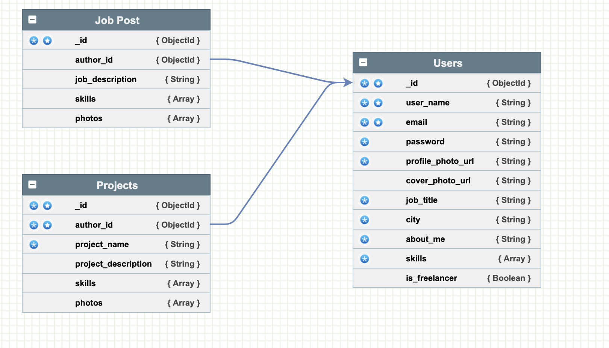
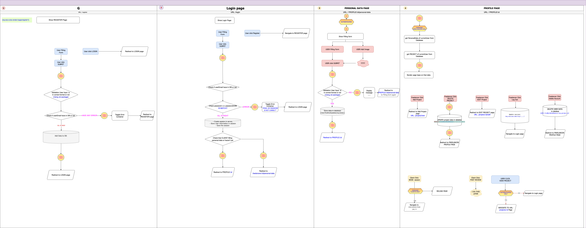

# Atom - A Freelancer App

## User Story

- Freelancers: Can post their project to attract clients, and look for job.
- Clients: Can post Job, and find the artisan they need on Atom, by discoer idea market => project => see freeelancer profile => email for them

## HEROKU APP LINK

## [link to App!](https://atom-freelancer-web.cyclic.app/freelancer-community)

## Technologies

- **dotenv** To protect tokens used in mongoDB and Mapbox
- **methodOverride** To allow for patch and delete
- **multer** handles multi-part form processing and image processing
- **imageKit.io** to store the upload image and return the URL for App
- **bcrypt** Used to hash passwords
- **express-session** For creating session-cookies and storing user information

## Experimented

- wireframing using **Figma** [Link Wireframe](https://www.figma.com/proto/PIPc4hfcP0IaGlS6lV2x3U/Project-2---aTom?page-id=0%3A1&node-id=11%3A2472&viewport=6%2C-518%2C0.11&scaling=scale-down&starting-point-node-id=11%3A2472)
- Planning data structure by **[nosqldbm.ru](https://nosqldbm.ru/)**
  
- Flowchart by **[diagrams.net](https://app.diagrams.net/#G1mhg2oI35cuIt7ReIdUJnBOvUOK3oXSPN)**
  

---

## Approach

- wireframing
- FlowChart
- Buil UI | CSS
- setting up database structure
- Build Schema
- Seed Data to data base
- Refactor into Ejs file
- set up mvc structure with crud routes
- create login/logout/authentication/authorisation
- testing of upload function with multer and imageKit.io
- final check
- deploy on Heroku

## RESTful Routes

| No. | Route | URL | HTTP Verb | Description            |
| --- | ----- | --- | --------- | ---------------------- |
| 1.  | Index | /   | GET       | Redirect to Login page |

- ### Page routes ( Public - for un-authenticated User)

| No. | Route | URL                   | HTTP Verb | Description                                |
| --- | ----- | --------------------- | --------- | ------------------------------------------ |
| 1.  | Index | /freelancer-community | GET       | All freelancer                             |
| 2.  | Index | /idea-market          | GET       | All photos from projects of all freelnacer |
| 3.  | Index | /job-market           | GET       | All jobs available in app Atom             |

- ### Project routes

| No. | Route  | URL                                            | HTTP Verb | Description                          |
| --- | ------ | ---------------------------------------------- | --------- | ------------------------------------ |
| 1.  | Index  | /projects/:project_id                          | GET       | Show Specific Project Page           |
| 2.  | New    | /projects/new                                  | GET       | Show Form to create new data Project |
| 3.  | Create | /projects/new                                  | POST      | add new data of Project to database  |
| 5.  | Edit   | /projects/:project_id/edit                     | GET       | Show Form to edit Project            |
| 6.  | Update | /projects/:project_id                          | PUT       | Update Project                       |
| 7.  | Delete | /projects/:project_id/delete                   | DELETE    | Delete Project                       |
|     | Delete | /projects/:project_id/:skillIndex/delete-skill | DELETE    | Delete Skill in Skills of Project    |
|     | Delete | /projects/:project_id/:photoIndex/delete-photo | DELETE    | Delete Photo in Photos of Project    |

- ### Job routes

| No. | Route  | URL                                    | HTTP Verb | Description                      |
| --- | ------ | -------------------------------------- | --------- | -------------------------------- |
| 1.  | Index  | /jobs/:job_id                          | GET       | Show Specific Job Page           |
| 2.  | New    | /jobs/new                              | GET       | Show Form to create new data Job |
| 3.  | Create | /jobs/new                              | POST      | add new data of Job to database  |
| 5.  | Edit   | /jobs/:job_id/edit                     | GET       | Show Form to edit Job            |
| 6.  | Update | /jobs/:job_id                          | PUT       | Update Job                       |
| 7.  | Delete | /jobs/:job_id/delete                   | DELETE    | Delete Job                       |
|     | Delete | /jobs/:job_id/:skillIndex/delete-skill | DELETE    | Delete Skill in Skills of Job    |
|     | Delete | /jobs/:job_id/:photoIndex/delete-photo | DELETE    | Delete Photo in Photos of Job    |

- ### Profile routes

  | No. | Route  | URL                                      | HTTP Verb | Description                             |
  | --- | ------ | ---------------------------------------- | --------- | --------------------------------------- |
  | 1.  | Index  | /profiles/:user_id                       | GET       | Show Profile of specific User           |
  | 2.  | New    | /profiles/:user_id/new                   | GET       | Show Form to create new data for profle |
  | 3.  | Create | /profiles/:user_id                       | POST      | add new data of User to database        |
  | 5.  | Edit   | /profiles/:user_id/edit                  | GET       | Show Form to edit profile               |
  | 6.  | Update | /profiles/:user_id                       | PUT       | Update profile                          |
  | 7.  | Delete | /profiles/:\_id/:skillIndex/delete-skill | DELETE    | Delete Skill in Skills of Specific user |

- ### Authenticated routes
  | No. | Route  | URL                            | HTTP Verb | Description          |
  | --- | ------ | ------------------------------ | --------- | -------------------- |
  | 1.  | Index  | /authenticated/login           | GET       | show login form      |
  |     |        | /authenticated/logout          | POST      | logout then redirect |
  |     |        | /authenticated/register        | GET       | form to add user     |
  | 2.  | Create | /authenticated/login           | POST      | create user session  |
  |     | Create | /authenticated/register        | POST      | add new user         |
  | 3.  | Delete | /authenticated/:user_id/delete | DELETE    | delete account       |

---

## Possible Improvements

- OAuth 2.0
- Chat box
- Review freelancer
- Add background in profile
